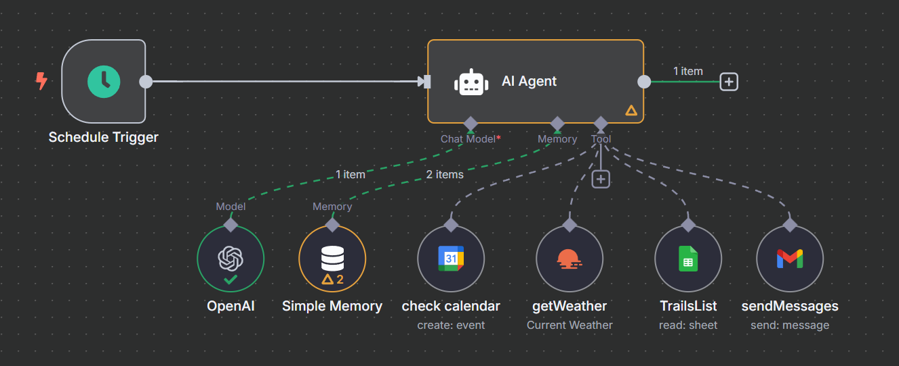

# AI Trail Run Agent 🏃‍♂️☁️ (n8n)

**AI-Powered Trail Run Assistant Built with n8n Orchestration**  
📅 **June 2025**

This project is an AI-powered assistant that recommends trail runs based on calendar events, real-time weather, and hiking trail data using GPT-4o-mini, Google APIs, and LangChain-compatible nodes — all orchestrated in [n8n](https://n8n.io/).

---

## 🚀 Features

✅ **Smart Calendar Awareness**  
Engineered an intelligent workflow in n8n using `Schedule Trigger`, which monitors daily Google Calendar events to detect trail run schedules, enabling time-aware autonomous decisions.

✅ **Weather + Trail Intelligence**  
Automated daily execution via n8n scheduler, evaluating trail attributes (distance, elevation, shade) against real-time Hyderabad weather to generate optimized recommendations.

✅ **Email Notifications with AI**  
Deployed Gmail integration for proactive user notifications, eliminating manual planning through personalized and weather-adaptive logic.

---

## 🛠 Tools & Technologies Used

- **n8n** – Low-code workflow automation
- **LangChain-compatible AI Agent** – Custom agent with memory and tool use
- **OpenAI GPT-4o-mini** – AI reasoning and message generation
- **Google Calendar API** – Reads scheduled events
- **OpenWeatherMap API** – Retrieves real-time weather for Hyderabad
- **Google Sheets API** – Stores and fetches trail data
- **Gmail API** – Sends trail run recommendations via email

---

## 🛡 Safety Note

> 🔐 All credentials, OAuth names, API tokens, and personal email addresses have been **redacted** for public sharing.  
> Always **review and sanitize** your JSON before uploading to GitHub.

---

